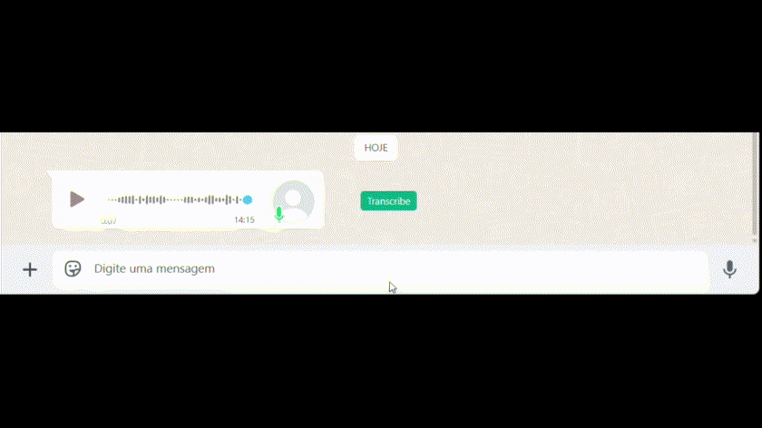

# WhatsApp Audio Transcription Chrome Extension Using GROQ API

A Chrome extension that adds transcription buttons to WhatsApp Web audio messages using the GROQ API.

Why Groq?
- Fast, basically free with their free tier, and the Whisper (turbo) model is really good.

⚠️ **Important Notice**

This extension is not officially associated with WhatsApp or Meta. Please be aware that:

- Using unofficial modifications to WhatsApp Web may violate WhatsApp's Terms of Service
- Audio data from messages is sent to GROQ's API for transcription
- We recommend only using this extension for personal, non-sensitive communications

## Features

- Automatically adds transcribe buttons to audio messages in WhatsApp Web
- Transcribes voice messages and audio files using GROQ's Whisper Large v3 model
- Clean integration with WhatsApp Web's interface
- Fast and accurate transcription results

## Installation

1. Clone or download this repository
2. Open Chrome and navigate to `chrome://extensions/`
3. Enable "Developer mode" in the top right corner
4. Click "Load unpacked" and select the directory containing these files

## Usage

1. After installation, visit https://web.whatsapp.com
2. The extension will automatically add "Transcribe" buttons next to audio messages
3. Click the button to transcribe any audio message
4. The transcription will appear below the audio message

## Technical Details

The extension works by:

1. Injecting custom UI elements into WhatsApp Web
2. Using WhatsApp's internal APIs to access audio data (thanks to [pedroslopez/whatsapp-web.js](https://github.com/pedroslopez/whatsapp-web.js))
3. Converting audio to the required format
4. Sending to GROQ's Whisper API for transcription
5. Displaying results in the WhatsApp interface